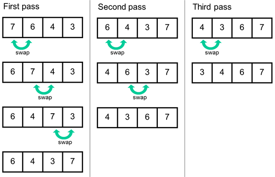
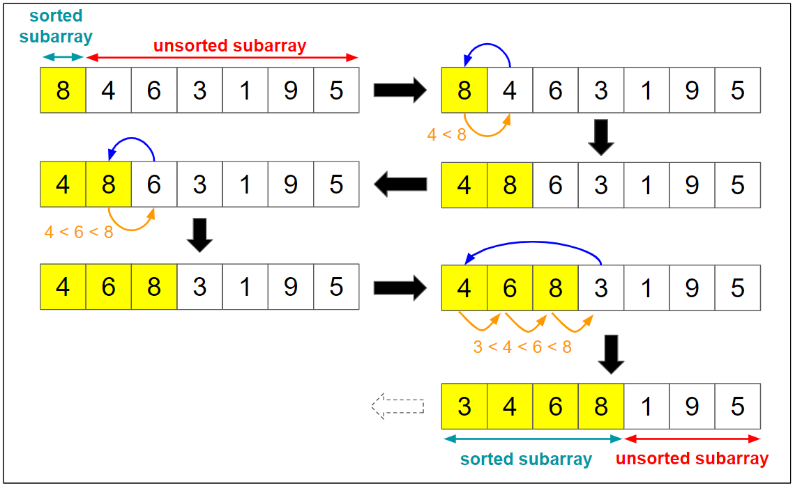
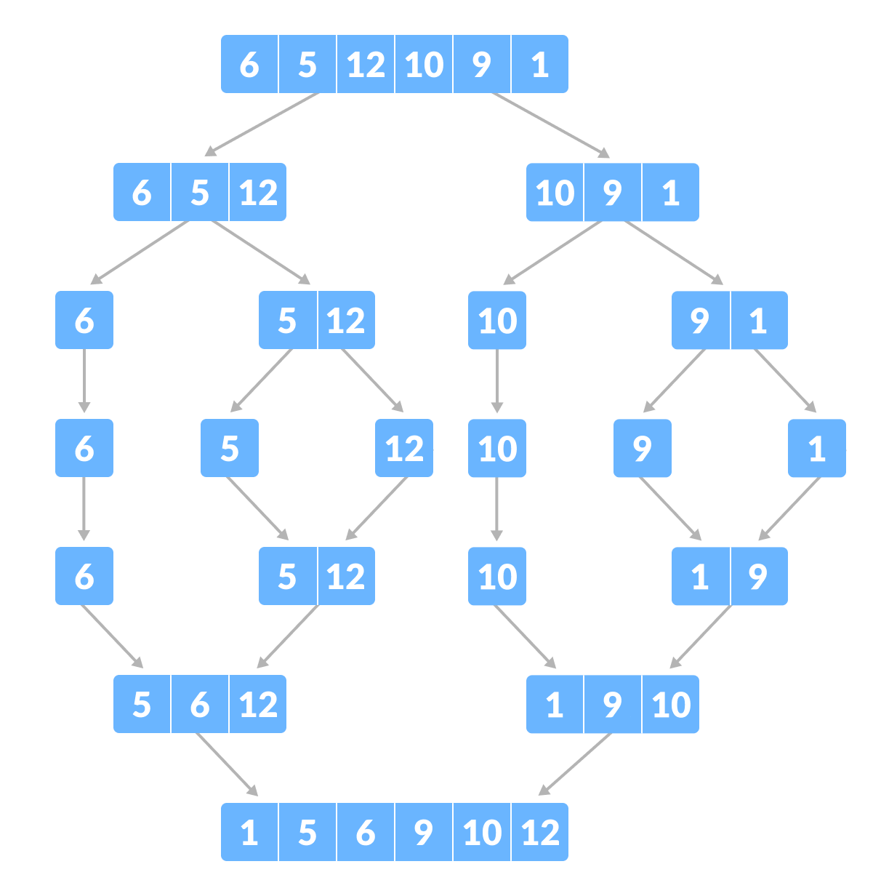
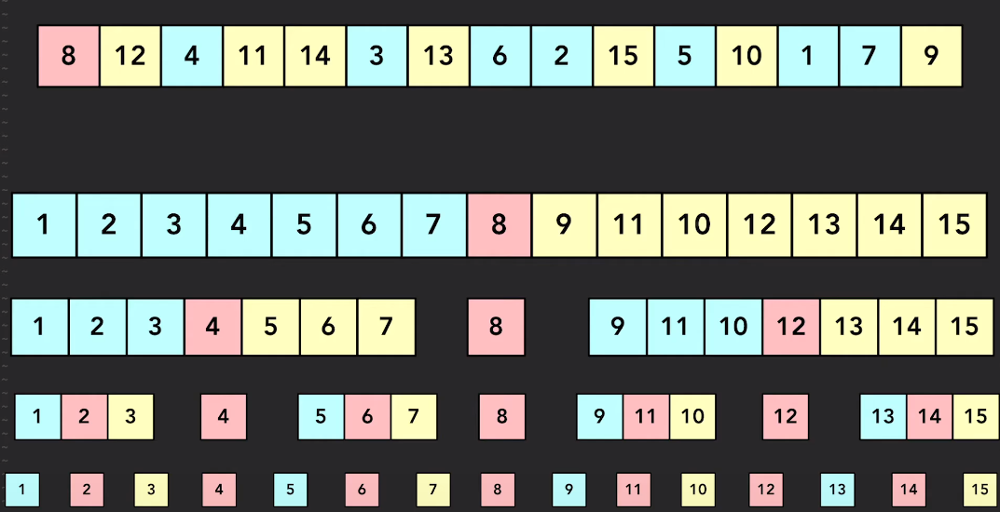

# Sorting Algorithms
## Bubble Sort

Algorithm for an array with n elements:
1. Compare leftmost element with it's neighbour
2. Swap values if needed so that the smaller number is on the left
3. Move onto the now first and second elements, compare, and swap
4. Continue until array has been iterated through. The largest number in the array has now "bubbled" to the end of the array
5. Repeat steps 1-5 n times, or for an optimized version only check values you know to be unsorted (i.e. on the second pass don't check the last value)



### C++ Implementation

```
template <typename T, size_t size>
void bubbleSort (T (&arr)[size]) { 
  
  for (int j=0; j<size-1;j++) {
    for (int i=0; i<size-1; i++) {
        if (arr[i] > arr[i+1]){
            T temp = arr[i];
            arr[i] = arr[i+1];
            arr[i+1] = temp;
        }
    }
  }
  return;
}
```


## Insertion Sort

To sort an array with n elements:

1. Set the key to the second element
2. Iterate over the array and compare the key to its predecessor. If the key is smaller, compare it to elements before that until you find the right place for it.
3. Move the larger elements up one to make space for the key
4. Increment the key
5. Repeat steps 1-4 until entire array is sorted



### C++ Implementation
```
void insertionSort(int arr[], int n)
{
    int i, key, j;
    for (i = 1; i < n; i++) {
        key = arr[i];
        j = i - 1;
 
        // Move elements of arr[0..i-1],
        // that are greater than key,
        // to one position ahead of their
        // current position
        while (j >= 0 && arr[j] > key) {
            arr[j + 1] = arr[j];
            j = j - 1;
        }
        arr[j + 1] = key;
    }
}
```

## Merge Sort
Divides array into smaller subarrays, sorts each sub array, then merges sorted subarrays back together

Algorithm for an array with n elements:

1. if the array has 1 element return that element
2. split the array into 2 halves
3. Sort each half
4. Merge the halves
   1. iterate through the left half, if the next value of the left half is larger than the right half, pop the next value of the right half into the merged array, else pop the value of the left half into the merged array
   2. return the merged array




### C++ Implementation
```
// Merges two subarrays of array[].
// First subarray is arr[begin..mid]
// Second subarray is arr[mid+1..end]
void merge(int array[], int const left, int const mid,
           int const right)
{
    int const subArrayOne = mid - left + 1;
    int const subArrayTwo = right - mid;
 
    // Create temp arrays
    auto *leftArray = new int[subArrayOne],
         *rightArray = new int[subArrayTwo];
 
    // Copy data to temp arrays leftArray[] and rightArray[]
    for (auto i = 0; i < subArrayOne; i++)
        leftArray[i] = array[left + i];
    for (auto j = 0; j < subArrayTwo; j++)
        rightArray[j] = array[mid + 1 + j];
 
    auto indexOfSubArrayOne = 0, indexOfSubArrayTwo = 0;
    int indexOfMergedArray = left;
 
    // Merge the temp arrays back into array[left..right]
    while (indexOfSubArrayOne < subArrayOne
           && indexOfSubArrayTwo < subArrayTwo) {
        if (leftArray[indexOfSubArrayOne]
            <= rightArray[indexOfSubArrayTwo]) {
            array[indexOfMergedArray]
                = leftArray[indexOfSubArrayOne];
            indexOfSubArrayOne++;
        }
        else {
            array[indexOfMergedArray]
                = rightArray[indexOfSubArrayTwo];
            indexOfSubArrayTwo++;
        }
        indexOfMergedArray++;
    }
 
    // Copy the remaining elements of
    // left[], if there are any
    while (indexOfSubArrayOne < subArrayOne) {
        array[indexOfMergedArray]
            = leftArray[indexOfSubArrayOne];
        indexOfSubArrayOne++;
        indexOfMergedArray++;
    }
 
    // Copy the remaining elements of
    // right[], if there are any
    while (indexOfSubArrayTwo < subArrayTwo) {
        array[indexOfMergedArray]
            = rightArray[indexOfSubArrayTwo];
        indexOfSubArrayTwo++;
        indexOfMergedArray++;
    }
    delete[] leftArray;
    delete[] rightArray;
}
 
// begin is for left index and end is right index
// of the sub-array of arr to be sorted
void mergeSort(int array[], int const begin, int const end)
{
    if (begin >= end)
        return;
 
    int mid = begin + (end - begin) / 2;
    mergeSort(array, begin, mid);
    mergeSort(array, mid + 1, end);
    merge(array, begin, mid, end);
}
```

## Quick Sort

Picks an element as a pivot and breaks array into 3 arrays of elements less than the pivot, equal to the pivot, and greater than the pivot. 



```
template<typename T>
void quickSort(std::list<T>& arr) {      
         
    //choose pivot
    //selects the median of 3 values taken from the front, back and middle of array
    T pivot;
    if (arr.size() >=3){
        std::vector<T> pivot_values; //vector to hold 3 potential pivots
        pivot_values.push_back(arr.front());

        //pick a value from the middle of arr
        std::list<int>::iterator it = arr.begin();
        std::advance(it, std::distance(arr.begin(), arr.end())/2);
        pivot_values.push_back(*it);

        pivot_values.push_back(arr.back());

        //sort 3 pivot values and select the one in the middle as the pivot
        std::sort(pivot_values.begin(),pivot_values.end());
        pivot = pivot_values[1];
    }
    else{
        //if array has less than three values, just select the first one for the pivot
        pivot = arr.front();
    }

    std::list<T> less;
    std::list<T> equal;
    std::list<T> greater;

    //Sort elements in arr into less, equal, and greater lists based on pivot
    for (T a : arr) {
        if(a< pivot){
            less.push_back(a);
        }
        else if (a == pivot) {
            equal.push_back(a);
        }
        else if (a > pivot){
            greater.push_back(a);
        }
    }

    //Don't do anymore sorting if size is 1
    if (less.size() > 1){
        quickSort(less);        
    }
    if (greater.size() > 1){
        quickSort(greater);    
    }
    
    //add equal to the end of less
    less.splice(less.end(), equal);

    //add greater to the end of less
    less.splice(less.end(), greater);

    //set arr to the sorted list
    arr = less;
    
    return;

};

```
## Bucket Sort
## Radix Sort 

```
/**
 * getDigit
 * Helper function for radixSort
 * Returns the digit of a value for processing
*/
template<typename T>
int getDigit(T v, int digit_place_){
	auto power = std::pow(10,(digit_place_ + 1));
	int int_power = static_cast<int>(power);
	int remainder = v % int_power;
	int floor = std::floor(remainder / std::pow(10, digit_place_));

	return floor;
}

/**
 * radixSort with iterators
 * Currently only implemented for integers
*/
template<typename Iter>
void radixSort(const Iter& begin, const Iter& end){

	const int len = std::distance(begin, end);//gets the length of the array to be sorted

	int numBuckets = 10;//number of buckets needed to sort integers

	std::vector<std::vector<int>> buckets(numBuckets);//store a bucket for each digit in buckets vector
	
	int digit_place = 0;

	while (buckets[0].size() < len){ //values are sorted when all elements in array are in bucket0, i.e. there are no more digits to sort	
		
		// empty the buckets from the previous loop
		for (int i=0; i<10; i++){
			buckets[i].clear(); 
		}

		// fill buckets
		for (auto j = begin; j != end; j++) {
			int digit = getDigit(*j, digit_place); //returns the digit we want to sort by
			buckets[digit].push_back(*j);
		}		

		//fill values from buckets
		auto k = begin;
		for (int i = 0; i < numBuckets; i++){
			for(auto element : buckets[i]){
				*k = element;
				k++;
			}
		}
		digit_place++; //sort by the next digits place
	}

	//move the values in bucket0 to values
	auto l = begin; 
	for (int m = 0; m < len; m++ ){
		*l = buckets[0][m];
		l++;
	}

	return;
}
```
