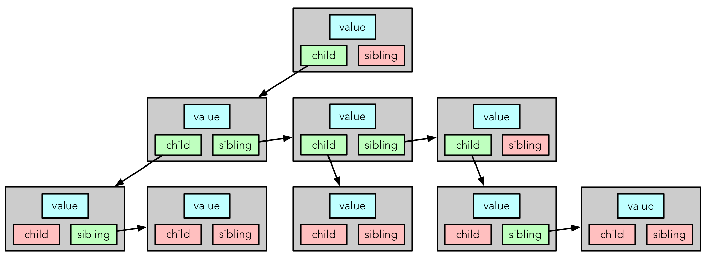
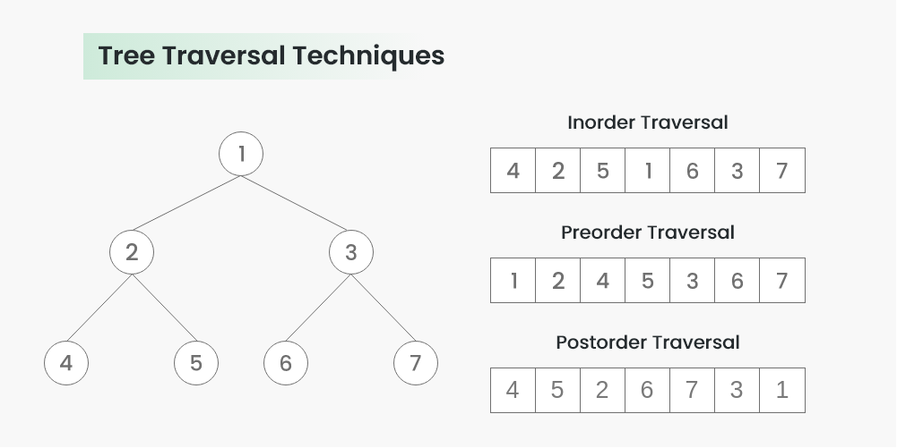
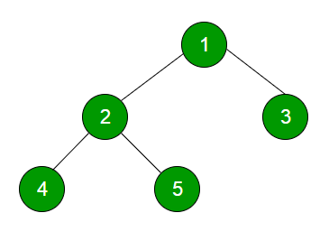

# Notes

Multiple trees are called a forest.

Every node only has one parent. 

# Tree Structures

Trees can have a vector of pointers to children:


This requires a lot pg dynamic memory allocation to manage all of the resizable children vectors.

A more efficient structure:


Each node only has two pointers per node: a pointer to it's first child and a pointer to it's next sibling. 

# Tree Traversal

## Depth First 


### Inorder Traversal

Algorithm:

1. Traverse left subtree (`Inorder(left->subtree)`)
2. Visit the root
3. Traverse right subtree (`Inorder(right->subtree)`)

Example C++ Implementation

```
// C++ program for different tree traversals
#include <bits/stdc++.h>
using namespace std;
 
// A binary tree node has data, pointer to left child
// and a pointer to right child
struct Node {
    int data;
    struct Node *left, *right;
};
 
// Utility function to create a new tree node
Node* newNode(int data)
{
    Node* temp = new Node;
    temp->data = data;
    temp->left = temp->right = NULL;
    return temp;
}
 
// Given a binary tree, print its nodes in inorder
void printInorder(struct Node* node)
{
    if (node == NULL)
        return;
 
    // First recur on left child
    printInorder(node->left);
 
    // Then print the data of node
    cout << node->data << " ";
 
    // Now recur on right child
    printInorder(node->right);
}
 
// Driver code
int main()
{
    struct Node* root = newNode(1);
    root->left = newNode(2);
    root->right = newNode(3);
    root->left->left = newNode(4);
    root->left->right = newNode(5);
 
    // Function call
    cout << "Inorder traversal of binary tree is \n";
    printInorder(root);
 
    return 0;
}
```

### Preorder Traversal

Algorithm:

1. Visit the root
2. Traverse the left subtree
3. Traverse the right subtree

Example C++ Implementation

```
// C++ program for different tree traversals
#include <bits/stdc++.h>
using namespace std;
 
// A binary tree node has data, pointer to left child
// and a pointer to right child
struct Node {
    int data;
    struct Node *left, *right;
};
 
// Utility function to create a new tree node
Node* newNode(int data)
{
    Node* temp = new Node;
    temp->data = data;
    temp->left = temp->right = NULL;
    return temp;
}
 
// Given a binary tree, print its nodes in preorder
void printPreorder(struct Node* node)
{
    if (node == NULL)
        return;
 
    // First print data of node
    cout << node->data << " ";
 
    // Then recur on left subtree
    printPreorder(node->left);
 
    // Now recur on right subtree
    printPreorder(node->right);
}
 
// Driver code
int main()
{
    struct Node* root = newNode(1);
    root->left = newNode(2);
    root->right = newNode(3);
    root->left->left = newNode(4);
    root->left->right = newNode(5);
 
    // Function call
    cout << "Preorder traversal of binary tree is \n";
    printPreorder(root);
 
    return 0;
}
```

### Postorder Traversal

Algorithm:

1. Traverse the left subtree
2. Traverse the right subtree
3. Visit the root

Example C++ Implementation

```
/ C++ program for different tree traversals
#include <bits/stdc++.h>
using namespace std;
 
// A binary tree node has data, pointer to left child
// and a pointer to right child
struct Node {
    int data;
    struct Node *left, *right;
};
 
// Utility function to create a new tree node
Node* newNode(int data)
{
    Node* temp = new Node;
    temp->data = data;
    temp->left = temp->right = NULL;
    return temp;
}
 
// Given a binary tree, print its nodes according to the
// "bottom-up" postorder traversal.
void printPostorder(struct Node* node)
{
    if (node == NULL)
        return;
 
    // First recur on left subtree
    printPostorder(node->left);
 
    // Then recur on right subtree
    printPostorder(node->right);
 
    // Now deal with the node
    cout << node->data << " ";
}
 
// Driver code
int main()
{
    struct Node* root = newNode(1);
    root->left = newNode(2);
    root->right = newNode(3);
    root->left->left = newNode(4);
    root->left->right = newNode(5);
 
    // Function call
    cout << "Postorder traversal of binary tree is \n";
    printPostorder(root);
 
    return 0;
}

```

## Breadth First (Level Order)

Traverses root first, then the root's children, the the root's "grandchildren". It's like printing out the nodes in levels starting from the top. 

Breadth First Traveral of this tree:



Looks like this:

```
1
2 3
4 5 
```

Algorithm

1. Find the height of the tree
2. For each level, run a recursive function by maintaining current height
3. Whenever the level of a node matches, print that node

Example C++ Implementation

```
// Recursive CPP program for level
// order traversal of Binary Tree
#include <bits/stdc++.h>
using namespace std;
 
// A binary tree node has data,
// pointer to left child
// and a pointer to right child
class node {
public:
    int data;
    node *left, *right;
};
 
// Function prototypes
void printCurrentLevel(node* root, int level);
int height(node* node);
node* newNode(int data);
 
// Function to print level order traversal a tree
void printLevelOrder(node* root)
{
    int h = height(root);
    int i;
    for (i = 1; i <= h; i++)
        printCurrentLevel(root, i);
}
 
// Print nodes at a current level
void printCurrentLevel(node* root, int level)
{
    if (root == NULL)
        return;
    if (level == 1)
        cout << root->data << " ";
    else if (level > 1) {
        printCurrentLevel(root->left, level - 1);
        printCurrentLevel(root->right, level - 1);
    }
}
 
// Compute the "height" of a tree -- the number of
// nodes along the longest path from the root node
// down to the farthest leaf node.
int height(node* node)
{
    if (node == NULL)
        return 0;
    else {
         
        // Compute the height of each subtree
        int lheight = height(node->left);
        int rheight = height(node->right);
 
        // Use the larger one
        if (lheight > rheight) {
            return (lheight + 1);
        }
        else {
            return (rheight + 1);
        }
    }
}
 
// Helper function that allocates
// a new node with the given data and
// NULL left and right pointers.
node* newNode(int data)
{
    node* Node = new node();
    Node->data = data;
    Node->left = NULL;
    Node->right = NULL;
 
    return (Node);
}
 
// Driver code
int main()
{
    node* root = newNode(1);
    root->left = newNode(2);
    root->right = newNode(3);
    root->left->left = newNode(4);
    root->left->right = newNode(5);
 
    cout << "Level Order traversal of binary tree is \n";
    printLevelOrder(root);
 
    return 0;
}
 
// This code is contributed by rathbhupendra

```